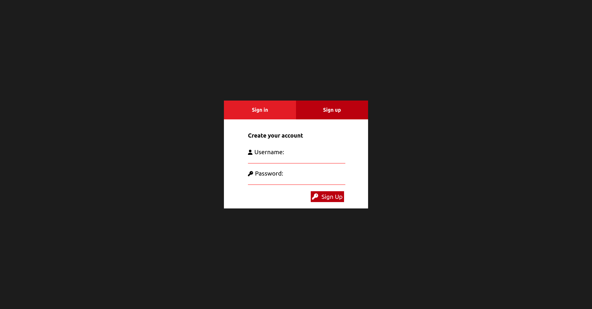
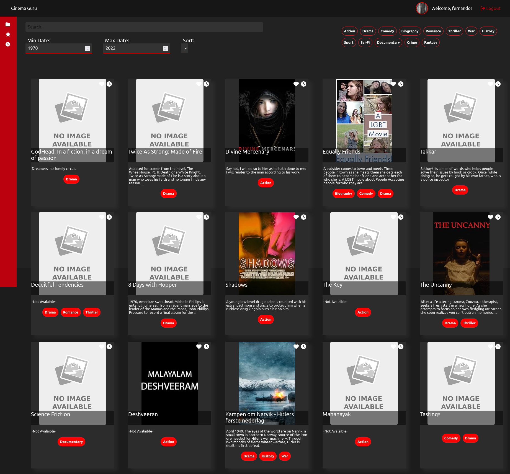

# Cinema Guru

Cinema Guru is a full-stack application developed as part of the Holberton School curriculum. The project focuses on mastering various aspects of React development for the frontend and utilizes a Holberton provided API for backend functionalities. This project includes managing state and props in a React component, using React hooks, implementing designs with JSX and CSS, creating a frontend application with React, and handling backend operations with a Dockerized server.

## The project aims to achieve the following learning objectives:

    Manage state and props in a React component: Gain proficiency in handling state and props within React components, understanding the flow of data and communication between parent and child components.

    Use React hooks to achieve certain behavior: Explore and implement React hooks to manage component state, side effects, and achieve specific functionalities in a more concise and efficient manner.

    Implement a design with JSX and CSS (React): Develop skills in creating user interfaces by implementing designs using JSX for component structure and CSS for styling within the React framework.

    Implement a frontend app with React: Create a fully functional frontend application using React, combining multiple components to deliver a seamless user experience.

## Technologies Used

### Frontend
*    React
*    React Hooks
*    React Font Awesome
*    React Router
*    axios

### Backend
*    Docker
*    Holberton provided API

## Demo

1. Clone the repository

2. Run yarn install to install all dependencies

3. Run yarn start to start the application

4. Open http://localhost:3000 to view it in the browser

## Screenshots

